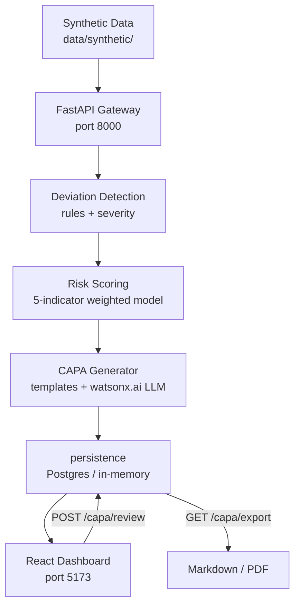

# explain in the flow of this project

---

**Status:** active  **Date:** 2026-09-15

---

### 👤 User

explain in the flow of this project

---

### 🤖 Assistant

> 🔧 called: list_files

Let me explore the project structure first.

> 🔧 **list_files** — .

### 🤖 Assistant

> 🔧 called: list_files, read_file


> 🔧 **read_file** — README.md

> 🔧 **list_files** — src

### 🤖 Assistant

> 🔧 called: read_file, read_file


> 🔧 **read_file** — src/backend/app/pipeline.py

> 🔧 **read_file** — src/backend/app/main.py

### 🤖 Assistant

> 🔧 called: read_file, read_file


> 🔧 **read_file** — src/detection/detector.py

> 🔧 **read_file** — src/risk_scoring/scoring.py

### 🤖 Assistant

> 🔧 called: read_file, read_file


> 🔧 **read_file** — src/detection/rules.py

> 🔧 **read_file** — src/capa/generator.py

### 🤖 Assistant

> 🔧 called: read_file, read_file


> 🔧 **read_file** — src/frontend/src/App.tsx

> 🔧 **read_file** — src/frontend/src/pages/TrialOverview.tsx

### 🤖 Assistant

Now I have a thorough picture of the entire project. Here's the complete flow:

---

## ClinIQ — Project Flow

**ClinIQ** is a clinical-trial risk management system built as a Bob-orchestrated multi-agent pipeline. Here's how data flows from raw patient records to a finalized CAPA report:

---

### 1. 📊 Data Generation (`src/data/generate_synthetic_data.py`)

Everything starts with synthetic data written to `data/synthetic/`:
- **`protocol.json`** — visit schedule, dosing rules, banned co-medications
- **`sites.json`** — trial sites with country, activation date, seed risk tier
- **`patients.json`** — patients assigned to sites
- **`visit_records.json`** — one record per patient visit (scheduled/actual dates, dosage, procedures, co-medications)

---

### 2. 🚀 API Gateway startup (`src/backend/app/main.py`)

On startup, [`_startup()`](src/backend/app/main.py:62) calls [`init_db()`](src/backend/app/db.py) (initialises Postgres or falls back to in-memory), then pre-loads `_protocol`, `_sites`, and `_visit_records` into module globals so every request is fast.

---

### 3. 🔁 Pipeline Trigger (`POST /pipeline/run`)

A single POST to `/pipeline/run` kicks off [`pipeline.run_pipeline()`](src/backend/app/pipeline.py:31), which chains four agents:

```
load data → detect deviations → score risk → generate CAPAs → persist
```

#### Step-by-step inside [`run_pipeline()`](src/backend/app/pipeline.py:31):

| # | What | Code |
|---|------|------|
| 1 | Load protocol + sites + visit records from disk | [`loaders.py`](src/risk_scoring/loaders.py) |
| 2 | **Deviation Detection** — for every visit record, run all rule checks, classify severity, emit `Deviation` objects | [`detector.detect_deviations()`](src/detection/detector.py:32) |
| 3 | Persist deviations | [`persistence.save_deviations()`](src/backend/app/persistence.py) |
| 4 | **Risk Scoring** — per-site weighted score (0–100) → High/Medium/Low band | [`scoring.rank_sites()`](src/risk_scoring/scoring.py:101) |
| 5 | Persist risk scores | [`persistence.save_risk_scores()`](src/backend/app/persistence.py) |
| 6 | For each **High**-band site, **Generate CAPA Report** | [`generator.generate()`](src/capa/generator.py:46) |
| 7 | Persist CAPA reports (status = `pending_review`) | [`persistence.save_capa_report()`](src/backend/app/persistence.py) |

---

### 3a. 🔍 Deviation Detection Agent (`src/detection/`)

[`rules.py`](src/detection/rules.py) has five deterministic rule checks run against every visit record:

| Rule | Deviation Type |
|------|----------------|
| [`check_missed_visit`](src/detection/rules.py:37) | `missed_visit` |
| [`check_late_visit`](src/detection/rules.py:44) | `late_visit` |
| [`check_dosage_out_of_range`](src/detection/rules.py:63) | `dosage_out_of_range` |
| [`check_banned_comedication`](src/detection/rules.py:73) | `banned_comedication` |
| [`check_missing_procedure`](src/detection/rules.py:81) | `missing_procedure` |

[`severity.py`](src/detection/severity.py) then classifies each `Finding` as **major / minor / administrative** per ICH E6 GCP rules, and [`detector.py`](src/detection/detector.py) packages them into stable, deterministic `Deviation` objects with SHA-1-derived IDs.

---

### 3b. 📈 Risk Scoring Agent (`src/risk_scoring/`)

[`scoring.compute_site_risk_score()`](src/risk_scoring/scoring.py:35) computes five weighted indicators for each site:

| Indicator | Weight |
|-----------|--------|
| Severity mix | 35% |
| Deviation frequency | 25% |
| Repeat offense rate | 20% |
| Recency weight | 10% |
| Trend slope | 10% |

Result: a 0–100 `risk_score`, a `risk_band` (High ≥ 70, Medium ≥ 40, Low < 40), and a `trend` (improving/stable/worsening).

---

### 3c. 📋 CAPA Generator Agent (`src/capa/`)

For every High-risk site, [`generator.generate()`](src/capa/generator.py:46):

1. Uses **[`templates.py`](src/capa/templates.py)** to produce deterministic root-cause, corrective-action, and preventive-action text based on deviation type and severity.
2. Optionally calls **[`llm_hook.py`](src/capa/llm_hook.py)** (watsonx.ai) to refine the narrative — falls back to the template baseline if unavailable.
3. Builds **evidence citations** structurally from `protocol_clause_ref` and **[`corpus.py`](src/capa/corpus.py)**'s ICH E6(R2) chunk index — the LLM is never involved here, preventing hallucination.
4. Returns a `CapaReport` with status `pending_review`.

---

### 4. 🧑‍⚕️ Human-in-the-Loop Review Gate

CAPA reports are never auto-finalized. A risk manager must call:

```
POST /capa/{capa_id}/review  { "decision": "approve" | "reject", "reviewer": "..." }
```

Only an `approved` report can be exported (`GET /capa/{capa_id}/export?format=markdown|pdf`). This mirrors real GCP audit-grade traceability.

---

### 5. 🖥️ React Frontend (`src/frontend/`)

The frontend has four routes, each backed by API calls to the single gateway on `:8000`:

```
/                          → TrialOverview   — stat tiles, site risk table, filter/sort
/sites/:siteId             → SiteDrilldown  — deviations + risk breakdown chart
/deviations/:deviationId   → DeviationDetail — full deviation + visit context
/capa/:capaId              → CapaView        — CAPA report + approve/reject button
```

---

### Architecture at a glance



The key design principle: **each agent is an independent module** (Tracks A/B/C in the team division), all wired together by the Track D gateway in a single in-process call chain — no inter-service HTTP hops needed for a full pipeline run.

---

### 👤 User

is all the .md file properly formeted

---

### 🤖 Assistant

> 🔧 called: glob

Let me read all the markdown files across the project.

> 🔧 **glob** — **/*.md

### 🤖 Assistant

> 🔧 called: spawn_subagent


> 🔧 **spawn_subagent** — explore

### 🤖 Assistant

All **28 markdown files** across the project are properly formatted. ✅

Quick summary of what was checked in each file:

| Check | Result |
|---|---|
| Heading syntax & nesting | ✅ All correct |
| Code fences (opening/closing) | ✅ All closed |
| Tables (pipes, separator rows) | ✅ All valid |
| List indentation consistency | ✅ No issues |
| Inline backtick pairing | ✅ All matched |
| Links (`[text](url)` completeness) | ✅ No empty hrefs or labels |
| YAML frontmatter (where present) | ✅ Valid |
| Truncated/incomplete sections | ✅ None found |

Every file from the root [`README.md`](README.md), through all [`docs/`](docs/), [`src/`](src/) module READMEs, [`DESIGN.md`](src/capa/DESIGN.md) files, and support files like [`CONTRIBUTING.md`](CONTRIBUTING.md) and [`CLAUDE.md`](CLAUDE.md) — all clean.