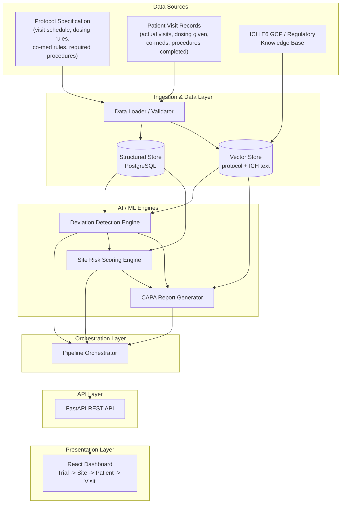

# Architecture

## System Architecture

## Components

| Component | Technology | Responsibility |
|---|---|---|
| Data Loader / Validator | Python | Parses protocol spec (JSON/YAML) and patient visit records (CSV/JSON), validates against the shared data schema, rejects malformed rows |
| Structured Store | PostgreSQL | Trials, sites, patients, visits, deviations, risk scores, CAPA reports |
| Vector Store | Chroma or FAISS | Chunked protocol text + ICH E6(R2) GCP guideline text, embedded for RAG retrieval |
| Deviation Detection Engine | Rule layer + watsonx.ai (RAG) | Detects missed/late visits, dosing out of range, banned co-medications, missing procedures; classifies severity (Major/Minor/Administrative) with a cited rationale |
| Site Risk Scoring Engine | Python, weighted-indicator model | Produces a 0–100 risk score per site from deviation frequency, severity mix, recency, trend, and repeat-offense rate, with the full indicator breakdown |
| CAPA Report Generator | watsonx.ai (RAG) | Drafts Root Cause / Corrective Action / Preventive Action / suggested owner & due date, grounded in the relevant protocol clause and deviation evidence |
| Pipeline Orchestrator | Python (assembled with IBM Bob) | Coordinates ingest → detect → score → generate CAPA → persist |
| Backend API | FastAPI | Thin layer validating requests, calling the appropriate engine, persisting/reading from PostgreSQL |
| Frontend | React | Trial Overview, Site Drill-down, Patient/Visit Drill-down, CAPA export |

## Data Flow

1. Protocol spec + patient visit records are loaded and validated by the Data Loader.
2. The Deviation Detection Engine scans all visits against the protocol and produces classified `Deviation` records (type, severity, rationale, protocol clause citation).
3. The Site Risk Scoring Engine consumes deviations plus visit volume per site and produces `RiskScore` records (score, band, indicator breakdown, trend).
4. The CAPA Report Generator consumes deviations (optionally grouped by site) and produces `CapaReport` records with evidence citations.
5. The FastAPI layer persists and serves all of the above through `/deviations`, `/risk-score`, `/capa`, and `/dashboard/summary` endpoints.
6. The React dashboard queries the API and renders trial → site → patient → visit drill-down views.

## Security Considerations

- Synthetic data only — no real patient data is used or required, but the system is designed as if handling PHI (role-based access, no PII in logs).
- Role-based access: Risk Manager, CRA, and QA/Regulatory roles see different views.
- Encryption in transit (HTTPS) at minimum for the demo deployment.
- Every deviation, score, and CAPA report is timestamped and versioned against the rule/model version that produced it, for audit traceability.
- Explainability by design: every AI output carries the evidence it used (protocol clause, indicator breakdown) so it can withstand audit scrutiny.
- Target compliance framework for a production version: **21 CFR Part 11** (electronic records/signatures) and **ICH E6(R2) GCP**.

## Scalability Notes

The FastAPI backend is stateless and could be horizontally scaled behind a load balancer. The demo dataset targets the reference scale named in the problem statement (5,000+ visits / 200+ sites); the watsonx.ai calls (deviation judgment, CAPA generation) are the likely bottleneck at larger scale and would benefit from batching and caching repeated clause lookups. A production version would replace the mocked EDC/CTMS ingestion with real integrations (e.g., Medidata Rave, Veeva) and add multi-trial/multi-tenant support.
